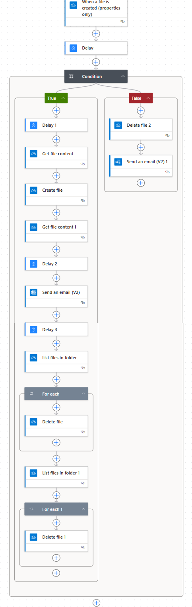

# Automated Reporting Workflow

## Overview

This project automates operational reporting by transforming raw table-based exports into standardized, analysis-ready outputs using Microsoft OneDrive, Power Automate, and Excel Office Scripts.

The workflow was designed to reduce manual reporting effort, improve consistency across outputs, and enable non-technical users to generate structured reports without needing advanced Excel or data transformation skills.

---

## Workflow

The automation process follows these steps:

1. A report is exported from an operational reporting system  
2. The file is placed into the OneDrive `Source_Data` folder (manual upload or integrated process)  
3. File placement triggers a Power Automate workflow  
4. An Excel Office Script is executed to transform the raw data  
5. The processed file is saved into the `Final_Outputs` folder  
6. The final file is renamed and distributed to stakeholders  

> The ingestion method is flexible and can be adapted depending on organizational tools (manual upload, scheduled exports, or system integration).

---

## System Architecture Overview

The workflow follows a simple layered structure:

**Data Inputs → Processing Layer → Output Layer**

- **Data Inputs:** Raw system exports stored in OneDrive  
- **Processing Layer:** Excel Office Scripts handling all transformation logic  
- **Output Layer:** Cleaned and standardized reports for distribution  

This structure ensures scalability, maintainability, and consistency across multiple reporting workflows.

---

## Business Impact

- Reduced manual effort required for report formatting and transformation  
- Standardized reporting outputs across teams and users  
- Enabled non-technical users to generate consistent reports without advanced Excel knowledge  
- Improved speed and reliability of stakeholder reporting delivery  
- Reduced errors caused by manual data manipulation  
- Increased operational efficiency by automating repetitive reporting tasks  

---

## Technologies Used

- Microsoft OneDrive  
- Microsoft Power Automate  
- Excel Office Scripts (TypeScript)  
- Microsoft Excel  

---

## Features

- Automated detection of new files via OneDrive folder monitoring  
- Trigger-based workflow using Power Automate  
- Office Script-based data transformation  
- Standardized formatting for dashboard-ready outputs  
- Separation of raw inputs and final outputs for scalability  
- Flexible ingestion methods (manual or system-driven uploads)  
- Automated file renaming and stakeholder distribution  
- Reusable transformation logic across multiple report types  

---

## Documentation

Full step-by-step setup instructions are available here:

- [Setup Guide](docs/setup-guide.md)

---

## Screenshots

### Workflow Overview
(Add explanation if needed—image already at top)

### Power Automate Flow
_Add your screenshot here:_
`docs/images/power_automate_flow.png`

### Folder Structure
`docs/images/folder_structure.png`

### Before vs After Output
`docs/images/before_after.png`

---

## Key Design Considerations

- Built to reduce reliance on advanced Excel knowledge  
- Designed for accessibility by non-technical users  
- Focused on standardization and repeatability across reports  
- Adaptable to different data ingestion methods depending on environment constraints  
- Structured to separate raw data, transformation logic, and final outputs for clarity and scalability  
